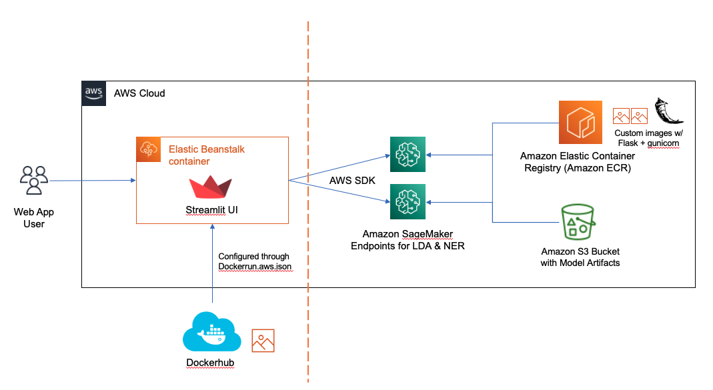
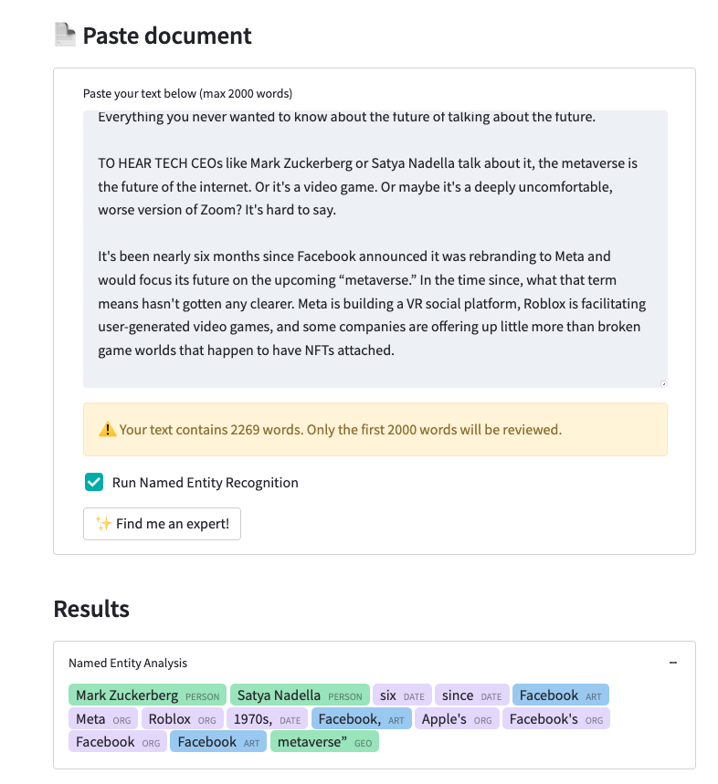
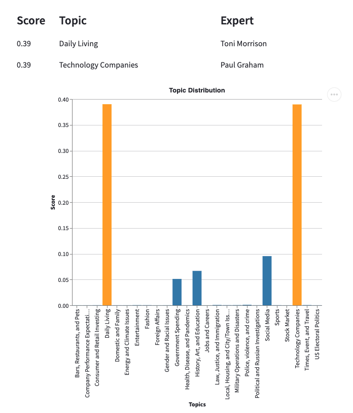

## GLG Topic Modeling

### Gerson Lehrman Group sponsored project on NLP

Team Members: Surnjani Djoko, Divy Gandhi, Prithvi Nuthanakalva

Description:
Given an article of text, this application will return a distribution of probabilities of what topic it could be and a subject matter expert associated with the topic.

It also does metadata tagging through Named Entity Recognition.

Essentially, this is a light weight UI that fronts a fine-tuned BERT model for NER and a custom LDA model that was trained on 2.2 million articles.

I have NOT uploaded the model artifacts in this repository.

Basic Components:
- Web app in streamlit for UI
- Flask container for LDA model (LDA Multicore using gensim)
- Flask container for NER model (Fine-tuned BERT model)

### How to reproduce deployment
Ideally I would write a script to get more of this done automatically. Also, I do not have the model artifacts uploaded to github. But those would be needed in a tar.gz format and uploaded to S3 to reproduce this.
But the process is as follows:
#### 1. Setup LDA Endpoint
- From the endpoint/container directory, Docker build and push images to a repository. You can run  ``./build_and_push docker_image_name`` to build and push it up to ECR
- Get the model artifacts saved into tar.gz files ``tar -czvf my-artifacts-LDA.tar.gz file1 file2 file3``
  - Make sure those files are the top level directory in the compressed file!!!
- Upload the file to an S3 bucket
- From the console (or however you prefer), go to Sagemaker and create a model using the S3 URI for the artifacts & the repository name from ECR (or wherever)
- You can view the cloudwatch logs to debug and see why the endpoint might be failing

#### 2. Setup NER Endpoint -- Same steps as LDA, different directory
- From the endpoint/container-bert-ner directory, Docker build and push images to a repository. You can run ``./build_and_push docker_image_name`` to build and push it up to ECR
- Get the model artifacts saved into tar.gz files ``tar -czvf my-artifacts-NER.tar.gz file1 file2 file3``
  - Make sure those files are the top level directory in the compressed file!!!
- Upload the file to an S3 bucket
- From the console (or however you prefer), go to Sagemaker and create a model using the S3 URI for the artifacts & the repository name from ECR (or wherever)
- You can view the cloudwatch logs to debug and see why the endpoint might be failing

#### 3. Setup UI Webapp
- From the glg-webapp directory, Docker build and push your application to a repository (I used a public Dockerhub file)
- Change the name located in the Dockerrrun.aws.json file to the name of the docker image for the glg-webapp you made
- From the console, you can upload your Dockerrun.aws.json file in Elastic Beanstalk by creating an application
- You will have to add the environment variables 'LDA_ENDPOINT' AND 'NER_ENDPOINT' to Elastic Beanstalk somehow
  - for this I had a file in glg-webapp/.streamlit/secrets.toml (not in the uploaded repository), but you can do it through AWS console I believe.

### Both of the model containers were deployed to Sagemaker.

### Screenshots of UI + NER:

### Screenshots of LDA Result:

References:
- https://ai.stanford.edu/~ang/papers/nips01-lda.pdf
- Text Analytics with Python: A Practitioner’s Guide to Natural Language Processing by Dipanjan Sarkar
- Blueprints for Text Analytics Using Python by Jens Albrecht, sidharth Ramachandran and Christian Winkler
- Practical Natural Language Processing by Sowmya Vajjala, Bodhisattwa Majumder, Anuj Gupta, Harshit Surana
- https://github.com/philschmid/huggingface-sagemaker-workshop-series
- https://github.com/aws/amazon-sagemaker-examples/tree/main/advanced_functionality/scikit_bring_your_own/container
- https://towardsdatascience.com/how-to-deploy-a-semantic-search-engine-with-streamlit-and-docker-on-aws-elastic-beanstalk-42ddce0422f3
